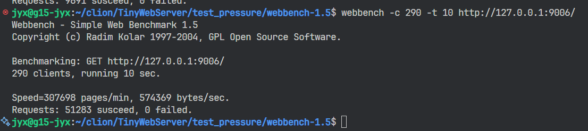

复刻知名的webserver项目，结合游双的《Linux高性能服务器编程》进行一定的修改

使用raii思想对代码进行修改与重构，使sql连接在使用时自动调用构造函数，从sql连接池取出连接，在使用完成后自动调用析构函数，释放连接

在html页面的登录注册页面，使用md5非对称加密对密码进行保护，http协议不明文传输密码，服务器端与数据库只会保存加密后的密码。同时也能实现防注入的功能

实现了proactor与reactor模式，通过改变readonce()操作与插入请求队列的顺序实现不同的模式

et与lt与oneshot的逻辑则是借鉴了游双的代码和tinywebserver的源码（看懂+抄=我实现了）

定时器则是通过简单的优先队列实现，没有使用时间轮。

html大部分使用tinywebserver的源码，在加密方式上稍作修改，能够获取视频和大文件，受限于wsl弱鸡的性能，在webbench中的测试成绩并不好，只能在使用290个端口
